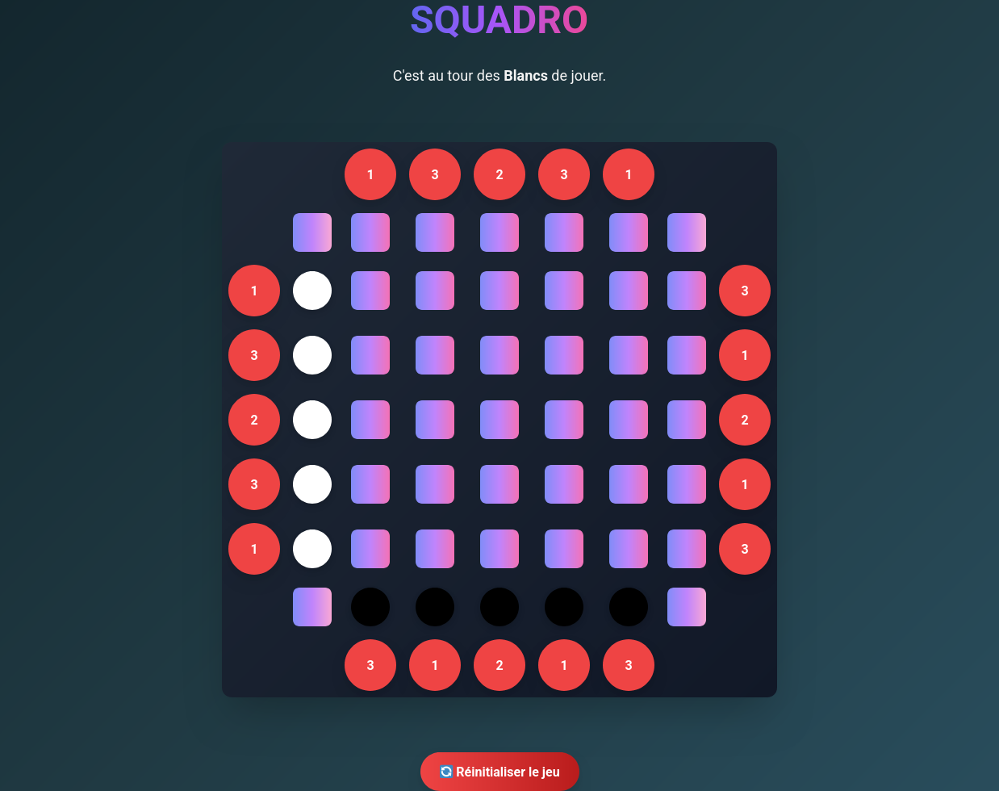

# Squadro

Squadro est un jeu développé en HTML, CSS et PHP orienté objet. Ce projet a été conçu comme une application web interactive pour proposer une expérience ludique et dynamique.

## Description

Squadro est un jeu de stratégie où chaque joueur doit manœuvrer ses pions de manière optimale pour atteindre l'objectif fixé. Ce projet a été réalisé dans le cadre d'un apprentissage approfondi des technologies web modernes et de la programmation orientée objet en PHP.

## Technologies utilisées

- **HTML5** : pour la structure des pages
- **CSS3** : pour le design et la mise en forme
- **PHP (POO)** : pour la logique métier et la gestion dynamique du jeu

Aperçu : 

